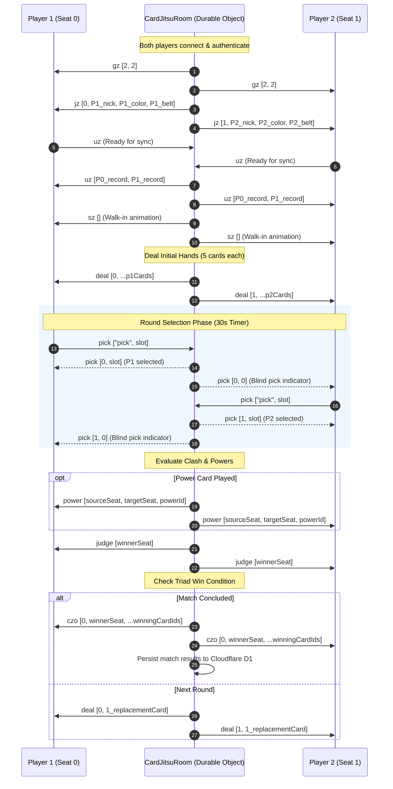

# Card-Jitsu Online Architecture & Multiplayer Specification (Draft)

This document specifies the technical design, protocol flow, and edge architecture for extending the Disney Card-Jitsu engine into a real-time, peer-to-peer or server-authoritative online multiplayer minigame on Nixlabs Games.

---

## 1. Architectural Vision

Card-Jitsu is inherently a two-player game. In the current standalone client, `session.ts` emulates the remote opponent using either progressive student bot tiers or Sensei. Because `session.ts` communicates with the Flash ActionScript 2 engine (`card.swf`) through strict SmartFox wire packets (`gz`, `jz`, `uz`, `sz`, `deal`, `pick`, `power`, `judge`, `czo`), migrating to online multiplayer does **not** require modifying `card.swf` or `card_bootstrap.swf`.

Instead, the TypeScript session layer is partitioned across a client bridge and an edge relay/room orchestrator:

```
┌───────────────────────────┐                     ┌───────────────────────────┐
│     PLAYER 1 (CLIENT)     │                     │     PLAYER 2 (CLIENT)     │
│  - Ruffle (card.swf)      │                     │  - Ruffle (card.swf)      │
│  - card_bootstrap.swf     │                     │  - card_bootstrap.swf     │
│  - OnlineSessionBridge    │                     │  - OnlineSessionBridge    │
└─────────────┬─────────────┘                     └─────────────┬─────────────┘
              │                                                 │
              │  WebSocket / Secure Transport                  │  WebSocket / Secure Transport
              ▼                                                 ▼
┌─────────────────────────────────────────────────────────────────────────────┐
│                 CLOUDFLARE DURABLE OBJECT: CardJitsuRoom                    │
│  - Server-Authoritative Card Dealing (using players' authenticated cj_card) │
│  - Blind Pick Synchronization (Seat 0 & Seat 1 lock-in)                     │
│  - Pure Clashing & Power Resolution (rules/clash.ts, rules/powers.ts)       │
│  - D1 Progression Persistence (/api/card-jitsu/match)                       │
└─────────────────────────────────────────────────────────────────────────────┘
```

---

## 2. SmartFox Wire Packet Exchange in Multiplayer

Both clients execute authentic Club Penguin Card-Jitsu protocol conventions:
- **Seat 0**: Player 1 (Host / Challenger)
- **Seat 1**: Player 2 (Challenged / Peer)
- **Seat -1**: Tie (in `judge` packet)

### 2.1 Match Lifecycle & Sequence Flow



---

## 3. Matchmaking & Room Management

### 3.1 Direct Message Chat Challenges (Integration with `challenges` table)
1. **Challenge Creation**:
   - In DM Drawer (`src/components/chat/dm-drawer.tsx`), player sends a Card-Jitsu Duel Challenge.
   - Entry created in `challenges` table: `{ gameSlug: 'card-jitsu', status: 'pending', bountyCandy: 25 }`.
2. **Acceptance & Launch**:
   - Recipient clicks **"Accept Duel"**.
   - Edge handler creates an ephemeral `CardJitsuRoom` Durable Object (ID: `challengeId`).
   - Both clients navigate to `/games/card-jitsu?roomId=<id>&seat=<0|1>`.
3. **Wager & Escrow**:
   - Optional Candy bounty placed in escrow from `players.candy`.
   - Winner of the duel receives the bounty upon match completion.

### 3.2 Public Dojo Matchmaking Queue
- Casual matchmaking: Players queue up under "Enter Dojo".
- Matchmaker pairs players with compatible Belt ranks (e.g. $|\text{belt}_1 - \text{belt}_2| \le 2$).
- Fallback: If no human opponent is matched within 15 seconds, seamlessly backfills with an authentic Dojo Student Bot from `BOT_TIERS` matching the player's belt level.

---

## 4. Fair Dealing & Server Authority Guarantees

1. **Inventory Verification**:
   - The room loads each player's authenticated collection directly from `cj_card` in D1.
   - Players can only be dealt cards they authoritatively own in their database binder.
2. **Blind Pick Zero-Knowledge Guarantee**:
   - When Player 1 selects a card, the server broadcasts `pick [0, slot]` only to Player 1.
   - Player 2 receives only an obfuscated indicator `pick [0, 0]` indicating that the opponent has locked in, preventing any wire snooping before both picks are committed.
3. **Reconnection & Disconnect Grace Period**:
   - If a player's WebSocket drops, the room allows a 20-second grace period.
   - If the player fails to reconnect before the round timer expires, a forfeit packet (`lz`) is resolved, awarding the victory to the remaining player.

---

## 5. Implementation Milestones

- **Phase 1 (Protocol Decoupling)**: Abstract `CardJitsuSession` into an interface `ICardJitsuSession` implemented by `LocalCardJitsuSession` (current bot engine) and `OnlineCardJitsuSession` (WebSocket client).
- **Phase 2 (Chat DM Duel Integration)**: Wire `/api/challenges` to mint Card-Jitsu duel rooms and render the custom challenge card in chat.
- **Phase 3 (Cloudflare Durable Object Room)**: Deploy `CardJitsuRoom` orchestrating two-seat matches, blind pick synchronization, and D1 persistence.
- **Phase 4 (Spectator Mode & Dojo Tables)**: Allow friends to click into an active match and spectate the duel mat in real-time.
